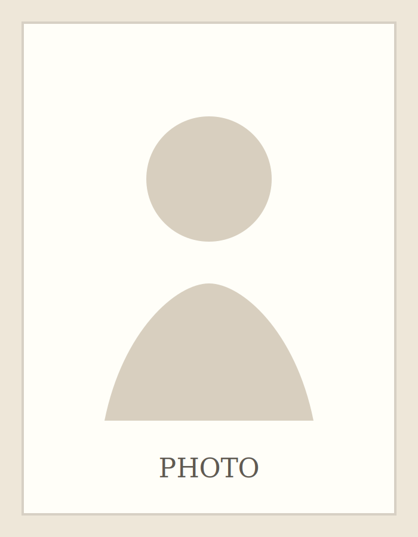

# 张扬帆个人网站模板：极简学术主页版

这是一个不需要数据库、不需要构建工具的静态个人网站。风格接近传统学者个人主页：文字优先、导航清楚、方便长期维护。

## 文件结构

```text
.
├── index.html              # 首页：Introduction / Blog / Research / Publications
├── archive.html            # Blog / Notes 归档页
├── post.html               # 单篇文章页
├── about.html              # About 页面
├── assets/
│   ├── styles.css          # 样式
│   ├── site.js             # 文章渲染、搜索、图片解析
│   └── images/             # 图片文件夹
│       ├── profile-placeholder.svg
│       └── sample-note.svg
└── data/
    └── posts.json          # 文章数据
```

## 可以插入图片吗？

可以。这个版本已经支持两种图片方式。

### 方式一：给文章加封面图

把图片放进 `assets/images/` 文件夹，例如：

```text
assets/images/maruyama-note.jpg
```

然后在 `data/posts.json` 的某篇文章里加入：

```json
"image": "assets/images/maruyama-note.jpg",
"image_alt": "丸山真男相关资料照片"
```

完整示例：

```json
{
  "slug": "my-new-post",
  "title": "我的新文章标题",
  "date": "2026-06-19",
  "tags": ["标签一", "标签二"],
  "excerpt": "这里写一两句话摘要。",
  "published": true,
  "image": "assets/images/maruyama-note.jpg",
  "image_alt": "丸山真男相关资料照片",
  "body": "正文写在这里。"
}
```

### 方式二：在正文中插入图片

正文支持这种 Markdown 图片写法：

```markdown

```

在 `posts.json` 里写正文时，因为换行需要写成 `
`，可以这样：

```json
"body": "## 小标题

这里是正文。


图片下面继续写正文。"
```

## 如何替换首页照片

首页和 About 页目前使用：

```text
assets/images/profile-placeholder.svg
```

你可以把自己的照片放进 `assets/images/`，例如：

```text
assets/images/profile.jpg
```

然后在 `index.html` 和 `about.html` 中把：

```html

```

改成：

```html

```

## 如何添加新文章

打开 `data/posts.json`，在最前面加入一段新的文章数据：

```json
{
  "slug": "my-new-post",
  "title": "我的新文章标题",
  "date": "2026-06-19",
  "tags": ["标签一", "标签二"],
  "excerpt": "这里写一两句话摘要。",
  "published": true,
  "body": "## 小标题

这里写正文。支持简单 Markdown：二级标题、列表、引用、加粗、斜体、代码、链接和图片。"
}
```

注意：

- `slug` 只能使用英文、数字和连字符，例如 `maruyama-notes-01`。
- `date` 使用 `YYYY-MM-DD` 格式。
- 如果暂时不想发布，把 `published` 改成 `false`。
- 图片建议放在 `assets/images/`，再用相对路径引用。

## 本地预览

因为浏览器安全限制，直接双击 `index.html` 有时无法读取 `posts.json`。推荐用一个本地服务器预览：

```bash
python -m http.server 8000
```

然后在浏览器打开：

```text
http://localhost:8000
```

## 部署到 GitHub Pages

1. 新建仓库，推荐命名为 `zzmuyi0728.github.io`。
2. 上传本文件夹里的所有文件。注意让 `index.html` 位于仓库最外层。
3. 在仓库 Settings → Pages 中选择从 `main` 分支、根目录 `/` 发布。
4. 以后每次修改 `posts.json`、HTML、CSS 或图片并提交，网站会自动更新。

## 后续可以继续升级

- 改成中英双语。
- 增加独立 CV 页面。
- 增加论文下载链接和 PDF 页面。
- 改成真正的 Markdown 文件写作流程，例如 Eleventy / Hugo / Astro。
- 增加 RSS 订阅。
